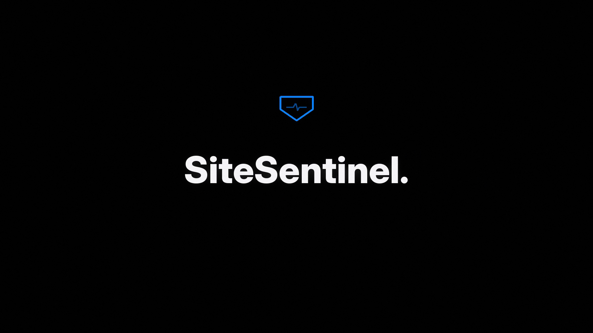

# SiteSentinel

A drop-in website security module that **participates live in your website's security**:
it watches every request and browser-side interaction, detects attacks in real time
(SQL injection, XSS, path traversal, command injection, scanner probes), **alerts the
owner instantly**, and **prevents the attack** by denying the request and auto-blocking
the source IP.

The detection model is trained on a real cyber-security dataset from Hugging Face:

> **YangYang-Research/web-attack-detection** — 625,904 labeled HTTP requests
> (294,771 attacks / 331,129 benign), covering SQL injection, XSS, command injection
> and LFI. MIT license. https://huggingface.co/datasets/YangYang-Research/web-attack-detection


## Watch the launch film

[](https://github.com/alwin123098/sitesentinel/releases/download/v1.0.0/sitesentinel-film.mp4)

*(52-second intro — click to play. Also on the [v1.0.0 release](https://github.com/alwin123098/sitesentinel/releases/tag/v1.0.0).)*

## What you get

| File | Purpose |
|---|---|
| `sentinel.js` | Browser module — add 2 script tags to any website. Watches URLs, form fields, outgoing fetch/XHR, DOM injections. |
| `server.js` | Zero-dependency Node backend: detection engine, alerting, auto-block, dashboard. Also exports an Express middleware. |
| `model.json` | Naive-Bayes model (4,000 token n-gram features) trained on the dataset above. |
| `signatures.json` | 24 regex attack signatures, each validated against all 625,904 dataset rows (attack vs benign hit-rates). |
| `stopwords.json` | Structural HTTP tokens stripped before scoring (prevents "looks like an HTTP request" bias). |
| `demo.html` | A demo site with the module installed + an attack simulator. |
| `dashboard.html` | Live owner dashboard (events, alerts, blocked IPs). |
| `train.py` | Retraining script — re-run any time to rebuild `model.json` from the dataset. |
| `config.json` | All thresholds, keys and alert endpoints. |

## Quick start (2 minutes)

```bash
node server.js          # zero npm installs — Node 18+
```

Then open:

- http://localhost:8080/ — demo site with the module installed (use the attack-simulator buttons)
- http://localhost:8080/sentinel/dashboard — live owner dashboard
- http://localhost:8080/sentinel/stats — JSON stats API

## Install on any website

**1. Host `server.js` + the JSON files** on any Node 18+ box (or serverless container) and
edit `config.json`:

```json
{
  "port": 8080,
  "siteKey": "generate-a-long-random-string",
  "webhookUrl": "https://hooks.slack.com/services/YYY/ZZZ",   // or Discord/Telegram/Zapier->email
  "ownerEmail": "you@example.com"
}
```

**2. Add the browser module to your site** (any site, any stack — WordPress, Shopify,
plain HTML, React, anything):

```html
<script>window.SENTINEL_CONFIG = { endpoint: "https://your-backend.example.com/sentinel/events", siteKey: "YOUR_SITE_KEY" };</script>
<script src="https://your-backend.example.com/sentinel.js" async></script>
```

**3. Protect your server routes** (Node/Express — the same engine used standalone):

```js
const { createSentinel } = require("./server.js");
const sentinel = createSentinel(require("./config.json"));

app.use(express.json());          // your existing body parser
app.use(sentinel.middleware);     // <-- one line: scan every request, deny + auto-block

sentinel.onAlert(alert => {       // hook email / SMS / anything
  sendEmail("you@example.com", "Attack on my site",
            `${alert.kind}: ${alert.reason} (${alert.ip})`);
});
```

For non-Node backends, run `server.js` as a standalone service and point the two script
tags at it, or port the ~200-line `SentinelEngine` class.

## How detection works

Two layers, both derived from the Hugging Face dataset:

**Layer 1 — signature rules (primary).** 24 regex families (SQL tautomies, UNION-based
SQLi, SLEEP/BENCHMARK blind SQLi, `<script>` / event-handler / `javascript:` XSS,
encoded XSS, path traversal, `/etc/passwd`, PHP wrappers, command injection,
sqlmap/nikto/nmap scanner fingerprints...). Each was validated against **all 625,904
dataset rows** — e.g. the SLEEP/benchmark pattern hits 6.86% of attack rows and **0 of
331,129** benign rows; `alert(`/`prompt(` hits 18.95% of attacks vs 0.001% benign.
Requests are scanned URL-decoded (double-decoding supported).

**Layer 2 — ML anomaly score (secondary).** Multinomial Naive Bayes over 4,000 token
uni/bi-grams, trained on 160,000 requests, structural HTTP tokens removed. Validation
(pure model, 16,000 held-out requests): precision 0.986, recall 0.964.
Deployed engine on 10,000 unseen rows: **99.93% precision** (3 false positives out of
5,000 benign), **88.9% strict-block recall** — the deployed verdict is deliberately
stricter than the raw model so legitimate users are never blocked; borderline traffic is
flagged `suspicious` (monitored, not blocked).

**Verdicts.**

- `clean` — nothing matched.
- `suspicious` — one weak signal or mild ML lean. Recorded, owner sees it on the dashboard.
- `malicious` — critical signature, 2+ signatures, or strong ML score. Request gets a 403,
  an **alert fires immediately** (webhook + `onAlert` listeners + `alerts.log.jsonl`), and
  the IP is **auto-blocked** for 15 minutes (configurable). Fewer-than-critical
  malicious hits accumulate strikes: 3 within 60s also triggers a block.

## Alerts to the owner

1. **Webhook** — any URL accepting JSON POST (Slack incoming webhook, Discord, Telegram
   bot API, Zapier → email/SMS). Set `webhookUrl` in `config.json`.
2. **`onAlert` listener** — plug in your own email/SMS code in one line.
3. **Persistent log** — every alert is appended to `alerts.log.jsonl`.
4. **Dashboard** — live view at `/sentinel/dashboard`.

## Privacy

The browser module never transmits field values — only the signature name that matched,
the field name, and a ≤120-char snippet of the matched region. Password/token fields are
never scanned. The server scans requests in memory but stores only verdicts, signature
names and metadata, never raw bodies.

## Tuning (`config.json`)

| Key | Default | Meaning |
|---|---|---|
| `mlThreshold` | 30 | ML log-odds needed for a malicious verdict (lower = stricter) |
| `strikeThreshold` | 3 | malicious hits per IP per `rateWindowMs` before auto-block |
| `rateWindowMs` | 60000 | strike counting window |
| `blockTtlMs` | 900000 | how long a blocked IP stays blocked |
| `criticalSignatures` | see file | signatures that block on first hit |

## Retraining

```bash
curl -L "https://huggingface.co/datasets/YangYang-Research/web-attack-detection/resolve/main/dataset.csv" -o dataset.csv
python3 train.py      # rebuilds model.json + stopwords.json (needs pandas only)
```

## Limitations (be honest with yourself)

- A browser script cannot stop a direct API attack that never loads your pages — that's
  what the server middleware/standalone service is for. Use both.
- Regex + NB is a first line of defence, not a substitute for parameterised queries,
  output encoding, CSP and dependency patching.
- IPs can be shared (mobile carriers, offices) — blocked IPs expire automatically after
  `blockTtlMs`.
- The dataset's benign class is plain sentences, so the ML layer treats ordinary
  English as the benign baseline — the reason structural tokens are stripped and the
  ML threshold is high. The regex layer is the primary detector.

## License

MIT. Model data: YangYang-Research/web-attack-detection (Hugging Face, MIT).

## Optional AI defensive triage

An optional server-side advisor can provide bounded defensive recommendations for alerts in the SiteSentinel-protected application. It accepts keys for OpenAI-compatible chat-completions providers through server-side environment variables. Keys must never be placed in browser code or committed config. See [AI-DEFENSE.md](AI-DEFENSE.md) for scope, setup, and data handling.
